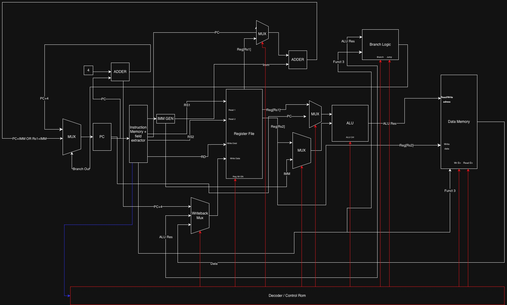

# RISC-V RV32I CPU — SystemVerilog Implementation

A from-scratch implementation of a **RISC-V RV32I single-cycle CPU** in SystemVerilog, paired with an interactive browser-based datapath visualizer. Built as a learning project at the University of Michigan.

> Reference: *Harris & Harris — Digital Design and Computer Architecture: RISC-V Edition*

---

## Live Visualizer

**[Launch the interactive datapath visualizer →](https://sidroy89.github.io/RISCV-32I-System-Verilog-Implementation/)**

Write RISC-V assembly in the browser, assemble it, and step through each clock cycle watching signals animate through the datapath in real time.

---

## Datapath Diagram



The diagram above shows the complete single-cycle datapath. White wires carry 32-bit data. Red wires are 1-bit control signals from the Decoder. Blue wires show the writeback path. Every component is described in detail below.

---

## How a RISC-V Instruction Executes — The Full Flow

In a single-cycle CPU, every instruction completes in exactly **one clock cycle**. The entire datapath is combinational — signals propagate from left to right through all components in a single cycle, and the only state elements (things that hold a value across cycles) are the **PC register** and the **register file**.

Here is the path a single instruction takes from fetch to writeback:

```
PC → IMEM → Field Extractor → Decoder
                            → IMM Gen
                            → Register File (read rs1, rs2)
                                → MUX A → ALU → Branch Logic → Next-PC MUX → PC (next cycle)
                                → MUX B ↗         ↓
                                               Data Memory
                                                   ↓
                                             Writeback MUX → Register File (write rd)
```

---

## Component Deep-Dive

### Program Counter (PC)
**File:** `rtl/datapath.sv`

The PC is a 32-bit register — the only clocked element in the fetch stage. It holds the address of the **currently executing instruction**. On every rising clock edge it updates to whatever `pc_next` is (either `PC+4` for sequential flow, or a branch/jump target).

In this implementation the PC resets to `0x80000000` — the address where RISC-V test programs are loaded in physical memory (DRAM starts here in virtually all RISC-V SoC designs).

---

### PC+4 Adder
**File:** `rtl/datapath.sv`

A simple combinational adder that always computes `PC + 4`. This is the default next PC for non-branch, non-jump instructions. It also feeds into the **Writeback MUX** so that JAL and JALR can write the return address (`PC+4`) into `rd`.

---

### Next-PC MUX
**File:** `rtl/datapath.sv`

A 2-to-1 mux that selects what the PC becomes next cycle:
- **0 → PC+4** — normal sequential execution
- **1 → branch/jump target** — when a branch is taken or a jump executes

The select signal (`pc_src`) comes from **Branch Logic**.

---

### Instruction Memory (IMEM)
**File:** `rtl/imem.sv`

A read-only memory array holding the program. Word-addressed (32-bit words), 16KB capacity. The PC is the address input and the 32-bit instruction word is output **combinationally** — no clock edge needed, the instruction is available the same cycle the PC changes.

At simulation time, the memory is pre-loaded with `$readmemh("tests/program.hex", memory)`. The module subtracts the `0x80000000` base so array index 0 corresponds to address `0x80000000`.

---

### Field Extractor
**File:** `rtl/field_extractor.sv`

The RISC-V instruction encoding places every field at a **fixed bit position** regardless of instruction type. The field extractor is purely wires — no logic at all — just slicing:

| Field | Bits | Width |
|-------|------|-------|
| `opcode` | [6:0] | 7 bits |
| `rd` | [11:7] | 5 bits |
| `funct3` | [14:12] | 3 bits |
| `rs1` | [19:15] | 5 bits |
| `rs2` | [24:20] | 5 bits |
| `funct7` | [31:25] | 7 bits |

These fields are distributed to the Decoder, Immediate Generator, Register File, and ALU.

---

### Immediate Generator (IMM GEN)
**File:** `rtl/imm_gen.sv`

RISC-V has 6 instruction formats (R/I/S/B/U/J), each scattering the immediate bits across different bit positions. The immediate generator reassembles and **sign-extends** the immediate to 32 bits based on the opcode.

| Format | Used by | Immediate construction |
|--------|---------|----------------------|
| **R** | ADD, SUB, AND… | No immediate |
| **I** | ADDI, LW, JALR… | `instr[31:20]` sign-extended |
| **S** | SW, SH, SB | `{instr[31:25], instr[11:7]}` sign-extended |
| **B** | BEQ, BNE, BLT… | `{instr[31], instr[7], instr[30:25], instr[11:8], 1'b0}` sign-extended |
| **U** | LUI, AUIPC | `{instr[31:12], 12'b0}` |
| **J** | JAL | `{instr[31], instr[19:12], instr[20], instr[30:21], 1'b0}` sign-extended |

Sign extension means filling the upper bits with copies of bit 31 (the sign bit), so a negative immediate stays negative in 32-bit arithmetic.

---

### Decoder / Control Unit
**File:** `rtl/decoder.sv`

The brain of the CPU. Purely combinational — takes `opcode`, `funct3`, and `funct7` as inputs and produces **10 control signals** that configure every mux and enable every write in the datapath. Nothing in the datapath makes a decision on its own; everything is driven by these signals.

| Signal | Width | Meaning |
|--------|-------|---------|
| `reg_write_en` | 1 | Enable write to the register file this cycle |
| `alu_src_mux_1` | 1 | ALU input A: 0 = rs1, 1 = PC (for AUIPC) |
| `alu_src_mux_2` | 1 | ALU input B: 0 = rs2, 1 = immediate |
| `alu_op` | 4 | Which ALU operation to perform (11 options) |
| `mem_we` | 1 | Data memory write enable (stores) |
| `mem_re` | 1 | Data memory read enable (loads) |
| `writeback_mux` | 2 | What to write to rd: 00=PC+4, 01=ALU result, 10=mem data |
| `branch` | 1 | This is a conditional branch instruction |
| `jump` | 1 | This is JAL or JALR |
| `PC_or_Rs1_mux` | 1 | Branch target adder input: 0=PC (branches/JAL), 1=rs1 (JALR) |

---

### Register File
**File:** `rtl/regfile.sv`

32 general-purpose 32-bit registers (`x0`–`x31`). Key properties:

- **Two asynchronous read ports** — `rs1` and `rs2` addresses produce data combinationally, same cycle
- **One synchronous write port** — writes happen on the rising clock edge (so the value written this cycle is available to read next cycle)
- **x0 is hardwired to zero** — any write to x0 is silently discarded; reads always return 0

This is the only state element in the execute/decode portion of the datapath.

---

### MUX A — ALU Source A
**File:** `rtl/datapath.sv`

Selects what goes into the ALU's first input:
- **0 → rs1 data** — used by most instructions (R-type, I-type, loads, stores, branches, JALR)
- **1 → PC** — used by AUIPC (`rd = PC + upper_imm`) and JAL

Controlled by `alu_src_mux_1` from the decoder.

---

### MUX B — ALU Source B
**File:** `rtl/datapath.sv`

Selects what goes into the ALU's second input:
- **0 → rs2 data** — used by R-type instructions (register-register operations)
- **1 → sign-extended immediate** — used by I/S/B/U/J-type instructions

Controlled by `alu_src_mux_2` from the decoder.

---

### ALU
**File:** `rtl/alu.sv`

Performs the core arithmetic/logic computation. Supports 11 operations selected by `alu_op[3:0]`:

| `alu_op` | Operation | Used by |
|----------|-----------|---------|
| `0000` | ADD | ADD, ADDI, loads, stores, AUIPC, JAL, JALR |
| `0001` | SUB | SUB, branch comparisons |
| `0010` | AND | AND, ANDI |
| `0011` | OR | OR, ORI |
| `0100` | XOR | XOR, XORI |
| `0101` | SLL | SLL, SLLI |
| `0110` | SRL | SRL, SRLI |
| `0111` | SRA | SRA, SRAI (arithmetic right shift — sign-extends) |
| `1000` | SLT | SLT, SLTI (signed less-than → result is 0 or 1) |
| `1001` | SLTU | SLTU, SLTIU (unsigned less-than) |
| `1010` | PASS\_B | LUI (just passes the immediate through, rs1 is ignored) |

The ALU result feeds into the Branch Logic, Data Memory (as the address for loads/stores), and the Writeback MUX.

---

### MUX T — PC vs RS1 (Branch Target Adder Input)
**File:** `rtl/datapath.sv`

Selects what the branch target adder uses as its base:
- **0 → PC** — for branches (PC-relative: `PC + imm`) and JAL (also PC-relative)
- **1 → rs1** — for JALR (register-relative: `rs1 + imm`)

Controlled by `PC_or_Rs1_mux` from the decoder.

---

### Branch Target Adder (PC/RS1 + Imm)
**File:** `rtl/datapath.sv`

Computes the jump/branch destination address. Always adds the sign-extended immediate to either PC or rs1 (selected by MUX T). For JALR, the RISC-V spec also requires the least-significant bit of the result to be cleared to 0 (enforces alignment).

---

### Branch Logic
**File:** `rtl/branch_logic.sv`

Determines whether to take a branch, and outputs `pc_src` to control the Next-PC MUX. Inputs:

- `branch` — is this a conditional branch? (from decoder)
- `jump` — is this JAL or JALR? (from decoder)
- `funct3` — encodes which branch condition (BEQ, BNE, BLT, BGE, BLTU, BGEU)
- `alu_result` — the ALU computed `rs1 - rs2`; the sign and zero of this result encode the comparison

For unconditional jumps (`jump = 1`), `pc_src` is always 1. For conditional branches (`branch = 1`), the result of the comparison (derived from the ALU output and funct3) determines `pc_src`. For all other instructions, `pc_src = 0` and the PC just increments to `PC+4`.

---

### Data Memory (DMEM)
**File:** `rtl/dmem.sv`

Read/write memory for program data. Key properties:

- **Byte-addressable** — internally stored as `logic [7:0] memory[MEM_SIZE]`
- **Little-endian** — byte 0 of a word is at the lowest address
- **16KB capacity** — located at `0x80002000` in the memory map (offset from the `0x80000000` base)
- **Supports 6 access widths** via `funct3`:

| `funct3` | Instruction | Access |
|----------|-------------|--------|
| `000` | LB / SB | signed byte |
| `001` | LH / SH | signed halfword |
| `010` | LW / SW | full word |
| `100` | LBU | unsigned byte |
| `101` | LHU | unsigned halfword |

The ALU result is used as the memory address. For stores, `rs2` is the write data. For loads, the read data is sign- or zero-extended to 32 bits and sent to the Writeback MUX.

---

### Writeback MUX
**File:** `rtl/datapath.sv`

A 3-to-1 mux that selects what value gets written back to the destination register `rd`:

| `writeback_mux` | Source | Used by |
|-----------------|--------|---------|
| `00` | PC+4 | JAL, JALR (save return address) |
| `01` | ALU result | R-type, I-type arithmetic, LUI, AUIPC |
| `10` | Memory read data | Loads (LW, LH, LB, LHU, LBU) |

The output of this mux is the `write_data` input to the register file. It only takes effect if `reg_write_en = 1`.

---

## Instruction Execution Examples

### `ADD x3, x1, x2`
R-type. `rs1=x1`, `rs2=x2`, `rd=x3`.
1. PC → IMEM fetches the instruction
2. Field extractor pulls out opcode=`0110011`, funct3=`000`, funct7=`0000000`
3. Decoder sets: `reg_write_en=1`, `alu_src_mux_2=0` (rs2), `alu_op=ADD`, `writeback_mux=01`
4. Register file reads `x1` and `x2`
5. MUX A selects rs1, MUX B selects rs2
6. ALU adds them → result
7. Writeback MUX selects ALU result → written to x3
8. PC+4 becomes the new PC

### `LW x5, 8(x2)`
I-type load. `rs1=x2`, `imm=8`, `rd=x5`.
1. Decoder sets: `reg_write_en=1`, `alu_src_mux_2=1` (imm), `alu_op=ADD`, `mem_re=1`, `writeback_mux=10`
2. Register file reads `x2`
3. IMM Gen sign-extends 8 → 32-bit `0x00000008`
4. ALU computes `x2 + 8` → memory address
5. DMEM reads the word at that address
6. Writeback MUX selects memory data → written to x5

### `BEQ x1, x2, label`
B-type branch. Compare `x1` and `x2`, jump if equal.
1. Decoder sets: `branch=1`, `alu_src_mux_2=0`, `alu_op=SUB`, `reg_write_en=0`
2. ALU computes `x1 - x2`
3. Branch Logic: if `funct3=BEQ` and result is zero → `pc_src=1`
4. Branch target adder computes `PC + imm`
5. Next-PC MUX selects the branch target → PC jumps to label

---

## Compliance Testing

Tests from the official [riscv-tests](https://github.com/riscv-software-src/riscv-tests) suite (`rv32ui-p` — physical memory, bare-metal):

```bash
bash scripts/run_tests.sh
```

**41 / 42 passing.**

The single failure is `fence_i` — a self-modifying code test that stores bytes to data memory and then executes from that address. This requires unified instruction/data memory. A Harvard architecture (separate IMEM and DMEM, as used here) cannot pass this test by design — the store goes to DMEM but IMEM is read-only and never updated.

---

## 5-Stage Pipeline (next)

The single-cycle design is correct but inefficient — the critical path runs through every stage (IMEM → register read → ALU → DMEM → writeback), so the clock period is set by the worst-case instruction even if most instructions don't need all stages.

The next step is a **5-stage pipeline** that overlaps execution of multiple instructions:

```
Cycle:   1    2    3    4    5    6    7
Instr 1: IF   ID   EX   MEM  WB
Instr 2:      IF   ID   EX   MEM  WB
Instr 3:           IF   ID   EX   MEM  WB
```

Each stage is separated by a **pipeline register** (IF/ID, ID/EX, EX/MEM, MEM/WB) that latches values on the clock edge, allowing up to 5 instructions to be in-flight simultaneously.

| Stage | Name | Work |
|-------|------|------|
| **IF** | Instruction Fetch | PC → IMEM → latch instruction |
| **ID** | Decode | Field extract, register read, control signals, immediate generation |
| **EX** | Execute | ALU operation, branch evaluation |
| **MEM** | Memory | DMEM read (loads) or write (stores) |
| **WB** | Writeback | Select result, write back to rd |

### Hazards

Pipelining introduces situations where a later instruction needs a result that an earlier instruction hasn't finished producing yet.

**Data hazard — RAW (Read After Write)**
```
add x1, x2, x3    # writes x1 in WB (cycle 5)
sub x4, x1, x5    # reads x1 in ID (cycle 3) — too early!
```
The `sub` tries to read `x1` before `add` has written it. Solution: **forwarding (bypassing)** — a forwarding unit detects this and routes the ALU result directly from the EX/MEM or MEM/WB pipeline register back to the EX stage input, skipping the register file entirely.

**Load-use hazard**
```
lw  x1, 0(x2)    # result not available until end of MEM
add x3, x1, x4   # needs x1 one cycle too early
```
Even with forwarding, the loaded value isn't available until after MEM, but the next instruction needs it at EX. One **stall cycle** (pipeline bubble) is unavoidable — the hazard detection unit freezes the IF/ID and PC registers for one cycle and inserts a NOP into ID/EX.

**Control hazard**
```
beq x1, x2, target   # branch not resolved until end of EX
add x3, x4, x5       # already fetched — might be wrong!
```
By the time the branch condition is evaluated in EX, the next instruction has already been fetched. If the branch is taken, that instruction must be **flushed** (replaced with a NOP). This costs one cycle on every taken branch.

---

## Repo Structure

```
rtl/                   synthesizable SystemVerilog modules
tb/                    testbenches
tests/                 riscv-tests binaries (not tracked in git — generate locally)
scripts/
  hex_convert.py       converts objcopy verilog output to $readmemh-compatible hex
  run_tests.sh         runs all rv32ui-p tests and reports pass/fail
visual/                interactive browser-based datapath visualizer
docs/                  notes and diagrams
sim/                   simulation output, gitignored
```

---

## Building and Running

**Dependencies:** `iverilog`, `riscv64-elf-gcc` (via Homebrew on macOS)

```bash
# Run all compliance tests
bash scripts/run_tests.sh

# Run the visualizer locally
cd visual && python3 -m http.server 8080
# open http://localhost:8080
```

---

## Tools

- **HDL:** SystemVerilog
- **Simulator:** `iverilog -g2012` + `vvp`
- **Toolchain:** `riscv64-elf-gcc` (Homebrew)
- **Compliance tests:** [riscv-tests](https://github.com/riscv-software-src/riscv-tests) rv32ui-p suite
- **Visualizer:** plain HTML/CSS/JS + CodeMirror (CDN) — no build step
