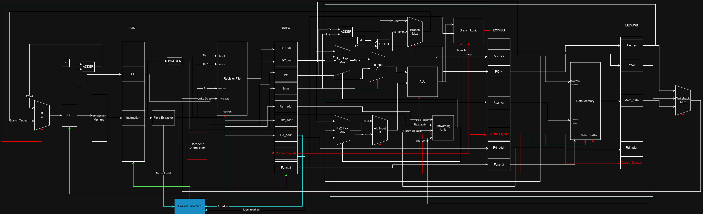

# RISC-V RV32I CPU — SystemVerilog Implementation

A from-scratch implementation of a **RISC-V RV32I CPU in SystemVerilog**, built in two versions: a single-cycle baseline and a 5-stage pipelined design with full forwarding and hazard detection. Paired with an interactive browser-based datapath visualizer for both implementations. Built as a learning project at the University of Michigan.

> Reference: *Harris & Harris — Digital Design and Computer Architecture: RISC-V Edition*

---

## Live Visualizer

**[Launch the interactive datapath visualizer →](https://sidroy89.github.io/RISCV-32I-System-Verilog-Implementation/)**

Write RISC-V assembly in the browser, assemble it, and step through each clock cycle watching data and control signals animate through every wire in the datapath in real time. Supports both single-cycle and pipeline modes — toggle between them in the toolbar.

---

## Implementations

| | Single-Cycle | 5-Stage Pipeline |
|---|---|---|
| **RTL** | `rtl/single_cycle/` | `rtl/pipeline/` |
| **Compliance** | 41 / 42 rv32ui-p | 41 / 42 rv32ui-p |
| **Hazard handling** | N/A | Full forwarding, load-use stall, branch flush |
| **Visualizer** | ✓ | ✓ |

---

# Part I — Single-Cycle CPU

## Datapath Diagram


In a single-cycle CPU every instruction completes in exactly **one clock cycle**. The entire datapath is combinational — signals propagate left to right through all components within a single cycle. The only state elements (things that hold a value across cycles) are the **PC register** and the **register file**.

```
PC → IMEM → Field Extractor → Decoder
                             → IMM Gen
                             → Register File (read rs1, rs2)
                                 → MUX A → ALU → Branch Logic → Next-PC MUX → PC
                                 → MUX B ↗         ↓
                                               Data Memory
                                                    ↓
                                              Writeback MUX → Register File (write rd)
```

---

## SC Component Deep-Dive

### Program Counter (PC)
**File:** `rtl/single_cycle/datapath.sv`

A 32-bit register — the only clocked element in the fetch stage. Holds the address of the currently executing instruction. On every rising clock edge it updates to `pc_next`: either `PC+4` for sequential flow or a branch/jump target. Resets to `0x80000000` — the address where RISC-V test programs are loaded in physical memory (DRAM starts here in virtually all RISC-V SoC designs).

---

### PC+4 Adder
**File:** `rtl/single_cycle/datapath.sv`

A combinational adder that always computes `PC + 4`. This is the default next PC for non-branch, non-jump instructions. Also feeds the Writeback MUX so JAL and JALR can save the return address into `rd`.

---

### Next-PC MUX
**File:** `rtl/single_cycle/datapath.sv`

A 2-to-1 mux controlled by `pc_src` from Branch Logic:
- **0 → PC+4** — normal sequential execution
- **1 → branch/jump target** — branch taken or unconditional jump

---

### Instruction Memory (IMEM)
**File:** `rtl/single_cycle/imem.sv`

Read-only memory holding the program. Word-addressed, 16 KB capacity. The PC is the address input and the 32-bit instruction word is output **combinationally** — no clock edge needed, the instruction is available the same cycle the PC changes. Pre-loaded at simulation time with `$readmemh`. Subtracts the `0x80000000` base so array index 0 corresponds to address `0x80000000`.

---

### Field Extractor
**File:** `rtl/single_cycle/field_extractor.sv`

RISC-V places every field at a **fixed bit position** regardless of instruction type, so the field extractor is purely wires — no logic at all, just slicing:

| Field | Bits | Width |
|-------|------|-------|
| `opcode` | [6:0] | 7 |
| `rd` | [11:7] | 5 |
| `funct3` | [14:12] | 3 |
| `rs1` | [19:15] | 5 |
| `rs2` | [24:20] | 5 |
| `funct7` | [31:25] | 7 |

---

### Immediate Generator (IMM GEN)
**File:** `rtl/single_cycle/imm_gen.sv`

RISC-V has 6 instruction formats, each scattering the immediate bits across different positions. The immediate generator reassembles and **sign-extends** the immediate to 32 bits based on the opcode:

| Format | Used by | Construction |
|--------|---------|-------------|
| **R** | ADD, SUB, AND… | No immediate |
| **I** | ADDI, LW, JALR… | `instr[31:20]` sign-extended |
| **S** | SW, SH, SB | `{instr[31:25], instr[11:7]}` sign-extended |
| **B** | BEQ, BNE, BLT… | `{instr[31], instr[7], instr[30:25], instr[11:8], 1'b0}` sign-extended |
| **U** | LUI, AUIPC | `{instr[31:12], 12'b0}` |
| **J** | JAL | `{instr[31], instr[19:12], instr[20], instr[30:21], 1'b0}` sign-extended |

---

### Decoder / Control Unit
**File:** `rtl/single_cycle/decoder.sv`

Purely combinational. Takes `opcode`, `funct3`, `funct7` and produces **10 control signals** that configure every mux and write-enable in the datapath. Nothing in the datapath makes a decision on its own.

| Signal | Width | Meaning |
|--------|-------|---------|
| `reg_write_en` | 1 | Enable write to register file |
| `alu_src_mux_1` | 1 | ALU A: 0 = rs1, 1 = PC (AUIPC) |
| `alu_src_mux_2` | 1 | ALU B: 0 = rs2, 1 = immediate |
| `alu_op` | 4 | ALU operation (11 options) |
| `mem_we` | 1 | Data memory write enable (stores) |
| `mem_re` | 1 | Data memory read enable (loads) |
| `writeback_mux` | 2 | rd source: 00=PC+4, 01=ALU, 10=mem |
| `branch` | 1 | Conditional branch instruction |
| `jump` | 1 | JAL or JALR |
| `PC_or_Rs1_mux` | 1 | Target base: 0=PC (branch/JAL), 1=rs1 (JALR) |

---

### Register File
**File:** `rtl/single_cycle/regfile.sv`

32 × 32-bit general-purpose registers (`x0`–`x31`):
- **Two asynchronous read ports** — rs1/rs2 addresses produce data combinationally the same cycle
- **One synchronous write port** — writes happen on the rising clock edge
- **x0 is hardwired to zero** — writes to x0 are silently discarded

---

### MUX A / MUX B — ALU Sources
**File:** `rtl/single_cycle/datapath.sv`

**MUX A** selects ALU input A: 0 → rs1 data (most instructions), 1 → PC (AUIPC, JAL).

**MUX B** selects ALU input B: 0 → rs2 data (R-type), 1 → sign-extended immediate (I/S/B/U/J-type).

---

### ALU
**File:** `rtl/single_cycle/alu.sv`

Performs the core computation. 11 operations selected by `alu_op[3:0]`:

| `alu_op` | Operation | Used by |
|----------|-----------|---------|
| `0000` | ADD | ADD, ADDI, loads, stores, AUIPC, JAL, JALR |
| `0001` | SUB | SUB, branch comparisons |
| `0010` | AND | AND, ANDI |
| `0011` | OR | OR, ORI |
| `0100` | XOR | XOR, XORI |
| `0101` | SLL | SLL, SLLI |
| `0110` | SRL | SRL, SRLI |
| `0111` | SRA | SRA, SRAI |
| `1000` | SLT | SLT, SLTI |
| `1001` | SLTU | SLTU, SLTIU |
| `1010` | PASS_B | LUI (passes immediate straight through) |

---

### Branch Target Adder + MUX T
**File:** `rtl/single_cycle/datapath.sv`

MUX T selects the base for the branch target adder: 0 → PC (branches, JAL), 1 → rs1 (JALR). The adder then computes `base + sign_extended_imm`. For JALR, the LSB of the result is forced to 0 per the RISC-V spec.

---

### Branch Logic
**File:** `rtl/single_cycle/branch_logic.sv`

Takes `alu_result`, `funct3`, `branch`, `jump` and outputs `pc_src`. For unconditional jumps `pc_src = 1` always. For conditional branches, the comparison result is derived from the ALU output (which computed `rs1 - rs2`) and funct3 encodes which condition to check (BEQ, BNE, BLT, BGE, BLTU, BGEU).

---

### Data Memory (DMEM)
**File:** `rtl/single_cycle/dmem.sv`

Byte-addressable, little-endian, 16 KB. Supports byte, halfword, and word accesses via funct3. The ALU result is the address; rs2 is write data for stores; read data is sign- or zero-extended to 32 bits for loads.

---

### Writeback MUX
**File:** `rtl/single_cycle/datapath.sv`

Selects what gets written to `rd`:

| `writeback_mux` | Source | Used by |
|-----------------|--------|---------|
| `00` | PC+4 | JAL, JALR (return address) |
| `01` | ALU result | R-type, I-type arithmetic, LUI, AUIPC |
| `10` | Memory read data | LW, LH, LB, LHU, LBU |

---

## SC Instruction Examples

### `ADD x3, x1, x2`
1. PC → IMEM fetches instruction; field extractor pulls opcode/funct3/funct7
2. Decoder: `reg_write_en=1`, `alu_src_mux_2=0`, `alu_op=ADD`, `writeback_mux=01`
3. Register file reads x1, x2
4. ALU adds → result written to x3; PC → PC+4

### `LW x5, 8(x2)`
1. Decoder: `reg_write_en=1`, `alu_src_mux_2=1`, `alu_op=ADD`, `mem_re=1`, `writeback_mux=10`
2. ALU computes `x2 + 8` → memory address
3. DMEM reads word at that address → writeback MUX selects mem data → written to x5

### `BEQ x1, x2, label`
1. Decoder: `branch=1`, `alu_src_mux_2=0`, `alu_op=SUB`, `reg_write_en=0`
2. ALU computes `x1 - x2`; Branch Logic checks zero flag with funct3=BEQ
3. If equal: `pc_src=1`, Next-PC MUX selects `PC + imm`; otherwise PC+4

---

# Part II — 5-Stage Pipeline CPU

## Datapath Diagram



The pipeline overlaps execution of up to **five instructions simultaneously** — one per stage each cycle. Four pipeline registers (IF/ID, ID/EX, EX/MEM, MEM/WB) latch values on every clock edge, passing state forward one stage per cycle.

```
Cycle:   1    2    3    4    5    6    7
Instr 1: IF   ID   EX   MEM  WB
Instr 2:      IF   ID   EX   MEM  WB
Instr 3:           IF   ID   EX   MEM  WB
Instr 4:                IF   ID   EX   MEM  WB
Instr 5:                     IF   ID   EX   MEM  WB
```

---

## Pipeline Stage Deep-Dive

### IF — Instruction Fetch
**Files:** `rtl/pipeline/cpu_top.sv`, `rtl/pipeline/imem.sv`

The PC drives IMEM combinationally. The fetched instruction and current PC value are latched into the **IF/ID pipeline register** on the clock edge. The PC updates to either `PC+4` (default) or the branch target computed in EX. If the Hazard Unit asserts a stall, the IF/ID register is frozen (write-disabled) and the PC holds its value — the same instruction is re-fetched next cycle.

**IF/ID register holds:** `PC`, `instruction`

---

### ID — Instruction Decode
**Files:** `rtl/pipeline/field_extractor.sv`, `rtl/pipeline/decoder.sv`, `rtl/pipeline/regfile.sv`, `rtl/pipeline/imm_gen.sv`

The instruction from IF/ID is decoded in parallel by four units:
- **Field Extractor** — splits instruction bits into opcode, rd, funct3, rs1, rs2, funct7
- **Decoder** — generates all control signals from opcode/funct3/funct7
- **Register File** — reads rs1 and rs2 asynchronously
- **Immediate Generator** — sign-extends the immediate for the instruction's format

All outputs are latched into the **ID/EX pipeline register**. If the Hazard Unit asserts a flush (branch taken), a NOP bubble is written into ID/EX instead.

**ID/EX register holds:** `PC`, `rs1_data`, `rs2_data`, `imm`, `rs1_addr`, `rs2_addr`, `rd_addr`, `funct3`, `ctrl` (all decoder outputs)

---

### EX — Execute
**Files:** `rtl/pipeline/datapath.sv`, `rtl/pipeline/alu.sv`, `rtl/pipeline/branch_logic.sv`

The most complex stage. Data flows through five layers before the ALU:

```
ID/EX rs1_data → FWD_MUX_A ─→ MUX_A ─→ ALU
                  ↑                ↑
              forwarded         PC (AUIPC)
              EX/MEM or
              MEM/WB result

ID/EX rs2_data → FWD_MUX_B ─→ MUX_B ─→ ALU
                  ↑                ↑
              forwarded         immediate
```

Two adders above the ALU compute branch targets:
- **PC_IMM_ADD** — computes `PC + imm` for branches and JAL
- **EX_PC4_ADD** — computes `PC + 4` for the JAL/JALR return address

**BR_MUX** selects between `PC+imm` and `rs1+imm` (JALR), controlled by `PC_or_Rs1_mux`.

**Branch Logic** takes `alu_result`, `funct3`, `branch`, `jump` → outputs `pc_src`. If taken, the Hazard Unit flushes IF and ID the next cycle.

Results latch into **EX/MEM**.

**EX/MEM register holds:** `alu_result`, `rs2_data`, `pc_plus4`, `rd_addr`, `ctrl`

---

### MEM — Memory Access
**Files:** `rtl/pipeline/dmem.sv`

The ALU result from EX/MEM is the memory address. For loads (`mem_re=1`), DMEM is read and the data is latched. For stores (`mem_we=1`), rs2_data from EX/MEM is written to DMEM. All other instructions pass through without touching memory.

Results latch into **MEM/WB**.

**MEM/WB register holds:** `alu_result`, `mem_read_data`, `pc_plus4`, `rd_addr`, `ctrl`

---

### WB — Writeback
**Files:** `rtl/pipeline/datapath.sv`, `rtl/pipeline/regfile.sv`

The WB MUX selects the value written back to `rd` in the register file:

| `writeback_mux` | Source | Used by |
|-----------------|--------|---------|
| `00` | PC+4 | JAL, JALR |
| `01` | ALU result | R-type, I-type arithmetic, LUI, AUIPC |
| `10` | Memory read data | Loads |

This write happens on the same clock edge that ID reads rs1/rs2 — the register file uses **write-first** behavior so a value written in WB is immediately available to be read in ID without a stall.

---

## EX Stage Units

### Forwarding Unit
**File:** `rtl/pipeline/datapath.sv`

Detects RAW (Read After Write) data hazards and selects the correct source for FWD_MUX_A and FWD_MUX_B by comparing rs1/rs2 addresses from ID/EX against rd addresses in EX/MEM and MEM/WB:

| `forward_a` / `forward_b` | Source |
|---------------------------|--------|
| `00` | Register file (ID/EX) — no hazard |
| `01` | EX/MEM ALU result — 1-cycle bypass |
| `10` | MEM/WB result — 2-cycle bypass |

Priority is given to the more recent result (EX/MEM over MEM/WB). Forwarding eliminates most RAW hazards with **zero cycle penalty**.

---

### Hazard Detection Unit
**File:** `rtl/pipeline/datapath.sv`

Monitors the pipeline for two situations that forwarding alone cannot handle:

**Load-use hazard** — If the instruction in EX is a load (`mem_re=1`) and its `rd_addr` matches rs1 or rs2 of the instruction currently in ID, the loaded value won't be available until end of MEM — one cycle after EX needs it. Resolution: assert `stall` for one cycle, which freezes the PC and IF/ID register and injects a NOP bubble into ID/EX.

**Branch flush** — When `pc_src=1` is resolved in EX, the instructions already in IF and ID are from the wrong path. Resolution: assert `flush`, which writes NOP bubbles into IF/ID and ID/EX, discarding those two instructions. Cost: 2 cycles per taken branch (always-not-taken prediction).

---

## Hazard Examples

### RAW Hazard — Forwarding (zero penalty)
```asm
add  x1, x2, x3    # x1 written at end of EX (cycle 3)
sub  x4, x1, x5    # needs x1 at start of EX (cycle 4) — forward from EX/MEM ✓
and  x6, x1, x7    # needs x1 at start of EX (cycle 5) — forward from MEM/WB ✓
```
Both dependents get the correct x1 via forwarding with no stall.

### Load-Use Hazard — 1-cycle stall
```asm
lw   x1, 0(x2)     # loaded value not available until end of MEM (cycle 4)
add  x3, x1, x4    # needs x1 at EX (cycle 4) — impossible without stall
```
Hazard unit stalls the pipeline for one cycle, then forwards the loaded value from MEM/WB → 1 cycle penalty.

### Control Hazard — Branch Flush (2-cycle penalty)
```asm
beq  x1, x2, target   # branch resolved at end of EX (cycle 3)
add  x3, x4, x5       # already in ID  ← flushed (NOP)
lw   x6, 0(x7)        # already in IF  ← flushed (NOP)
# target:
sub  x8, x9, x10      # correct instruction, now in IF
```
If the branch is taken, two instructions behind it are replaced with NOP bubbles.

---

## Pipeline Instruction Examples

### `ADD x3, x1, x2` (no hazards)

| Cycle | IF | ID | EX | MEM | WB |
|-------|----|----|-----|-----|-----|
| 1 | ADD | — | — | — | — |
| 2 | next | ADD | — | — | — |
| 3 | … | … | ADD: ALU=x1+x2 | — | — |
| 4 | … | … | … | ADD: pass-thru | — |
| 5 | … | … | … | … | ADD: x3←result |

### `LW x1, 0(x2)` followed by `ADD x3, x1, x4` (load-use)

| Cycle | IF | ID | EX | MEM | WB |
|-------|----|----|-----|-----|-----|
| 1 | LW | — | — | — | — |
| 2 | ADD | LW | — | — | — |
| 3 | ADD | **stall** | LW: addr=x2+0 | — | — |
| 4 | next | ADD | **NOP** | LW: mem read | — |
| 5 | … | … | ADD: x1 fwd←MEM/WB | LW: pass | — |
| 6 | … | … | … | ADD | LW: x1←mem |

### `BEQ x1, x2, target` (taken branch)

| Cycle | IF | ID | EX | MEM | WB |
|-------|----|----|-----|-----|-----|
| 1 | BEQ | — | — | — | — |
| 2 | A | BEQ | — | — | — |
| 3 | B | A | BEQ: taken, pc_src=1 | — | — |
| 4 | target | **NOP** (flush B) | **NOP** (flush A) | BEQ | — |
| 5 | target+4 | target | NOP | NOP | BEQ |

---

# Compliance Testing

Tests from the official [riscv-tests](https://github.com/riscv-software-src/riscv-tests) suite (`rv32ui-p` — physical memory, bare-metal):

```bash
# Run single-cycle tests
bash scripts/run_tests.sh sc

# Run pipeline tests
bash scripts/run_tests.sh pipe
```

**41 / 42 passing on both implementations.**

The single failure is `fence_i` — a self-modifying code test that stores bytes to data memory and then executes from that address. This requires unified instruction/data memory (von Neumann). A Harvard architecture (separate IMEM and DMEM, as used here) cannot pass this by design — the store goes to DMEM but IMEM is read-only and never updated.

---

## Repo Structure

```
rtl/
  single_cycle/      synthesizable SC modules (field_extractor, imm_gen, decoder,
                     alu, regfile, branch_logic, dmem, imem, datapath, cpu_top)
  pipeline/          synthesizable pipeline modules (same components + pipeline regs,
                     forwarding unit, hazard detection unit)
tb/
  single_cycle/      SC testbenches
  pipeline/          pipeline testbenches
visual/              interactive browser-based datapath visualizer (both SC + pipeline)
scripts/
  run_tests.sh       runs all rv32ui-p tests, reports pass/fail per test
  hex_convert.py     converts riscv-tests objcopy output to $readmemh-compatible hex
tests/               riscv-tests rv32ui binaries (gitignored — generate locally)
docs/                design decision notes for both implementations
sim/                 simulation output (gitignored)
```

---

## Building and Running

**Dependencies:** `iverilog` + `vvp`, `riscv64-elf-gcc` (Homebrew on macOS)

```bash
# Run all compliance tests (sc or pipe)
bash scripts/run_tests.sh sc
bash scripts/run_tests.sh pipe

# Launch the visualizer locally
cd visual && python3 -m http.server 8080
# open http://localhost:8080
```

---

## Tools

| | |
|--|--|
| **HDL** | SystemVerilog |
| **Simulator** | `iverilog -g2012` + `vvp` |
| **Toolchain** | `riscv64-elf-gcc` (Homebrew) |
| **Compliance tests** | [riscv-tests](https://github.com/riscv-software-src/riscv-tests) rv32ui-p |
| **Visualizer** | HTML/CSS/JS + CodeMirror — no build step, no framework |
